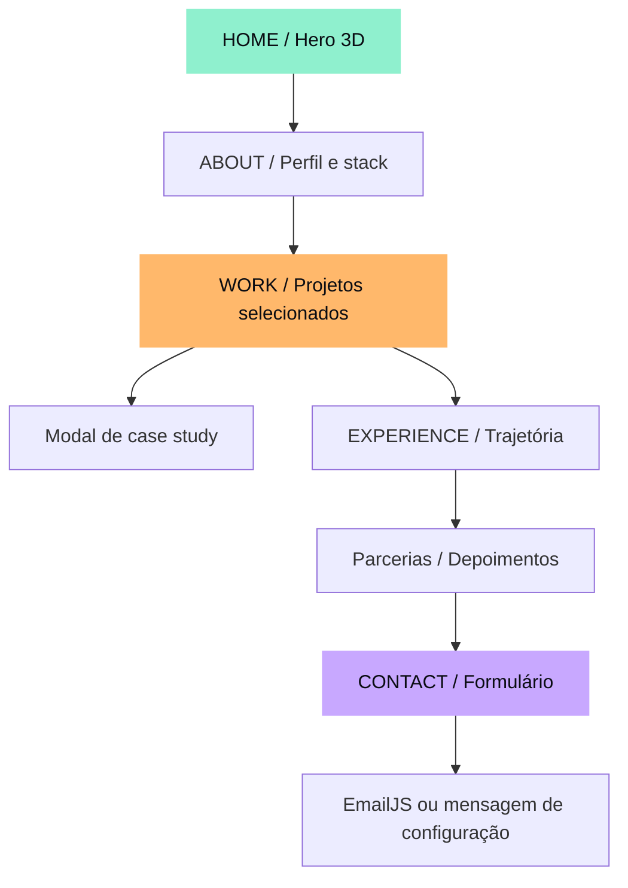
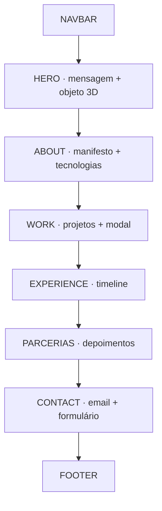

# studio.dev

> Portfólio interativo para frontend engineering e creative development.

## Visão visual

O portfólio foi desenhado como uma experiência editorial escura, com tipografia expressiva, acentos em verde e laranja e um objeto 3D interativo no hero.



### Composição da página



## Experiência

- Hero com cena 3D procedural, iluminação, partículas e controles de rotação.
- Navegação responsiva com menu mobile.
- Projetos orientados por dados e modal acessível para cada case.
- Timeline de experiências e depoimentos.
- Formulário de contato preparado para EmailJS.
- Botão para copiar o email para a área de transferência.
- Layout responsivo e suporte a `prefers-reduced-motion`.

## Stack

| Tecnologia | Uso |
| --- | --- |
| React | Componentes e estado da interface |
| Vite | Desenvolvimento e build de produção |
| Tailwind CSS | Base de estilos e tokens |
| React Three Fiber | Cena 3D no hero |
| Drei e Three.js | Controles, geometria e materiais 3D |
| Lucide React | Ícones da interface |
| EmailJS | Envio opcional do formulário |

## Estrutura

```text
src/
├── App.jsx                    # Composição da página
├── data.js                    # Projetos, experiências, skills e depoimentos
├── index.css                  # Tokens, layout e responsividade
├── components/
│   ├── Scene.jsx              # Cena 3D do hero
│   ├── ProjectModal.jsx       # Modal dos projetos
│   └── ContactForm.jsx        # Formulário e estados de envio
└── main.jsx                   # Entrada do React

.github/workflows/deploy.yml   # Deploy automático no GitHub Pages
vite.config.js                 # Base adaptável para Pages e Vercel
.env.example                   # Variáveis do EmailJS
```

## Executar localmente

```bash
npm install
npm run dev
```

Abra [http://localhost:5173/](http://localhost:5173/).

Para validar a versão de produção:

```bash
npm run lint
npm run build
npm run preview
```

## EmailJS

Copie `.env.example` para `.env` e preencha:

```env
VITE_EMAILJS_SERVICE_ID=
VITE_EMAILJS_TEMPLATE_ID=
VITE_EMAILJS_PUBLIC_KEY=
```

Sem essas variáveis, o formulário continua funcionando visualmente e informa que a configuração ainda não foi ativada.

## Publicação

O repositório está em [FernandesManu/3D-Dev-Portfolio](https://github.com/FernandesManu/3D-Dev-Portfolio).

- **Vercel:** importe o repositório, use `npm run build` e `dist` como output.
- **GitHub Pages:** o workflow em `.github/workflows/deploy.yml` publica após ativar **Settings → Pages → GitHub Actions**.

> O domínio da Vercel depende de um deployment ativo no painel da Vercel. O ambiente local (`localhost`) não é um link público.

## Personalização

Edite [src/data.js](src/data.js) para trocar projetos, tecnologias, experiências e depoimentos. O conteúdo visual principal está em [src/App.jsx](src/App.jsx), e a direção visual está em [src/index.css](src/index.css).
